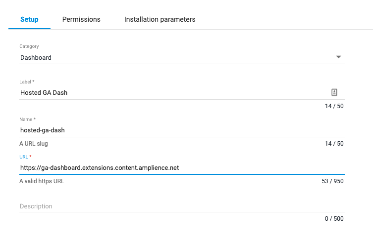

[](https://amplience.com/dynamic-content)

# dc-extension-ga-dashboard

## How to install

This extension needs to be [registered](https://amplience.com/docs/development/registeringextensions.html) against a Hub with in the Dynamic Content application (Developer -> Extensions), for it to load within that Hub.

The dashboard requires a specific configuration to work with Google Analytics and the following example settings need to be defined.

### Google Analytics Service Account Authorization

By default the dashboard will allow users to login to their Google account to view analytics data on the dashboard. To avoid this a Service Account can be created allowing the dashboard to authorize using a private key and client email.

1. Create a Google APIs [Service Account](https://console.cloud.google.com/iam-admin/serviceaccounts)
1. In the Service Account edit screen in the 'Keys' section add a key
1. Securely store the generate json file
1. From the json file copy the "private_key" and add it to the installation params as "googleAnalyticsKey"
1. Do the same for "client_email" adding it as "googleAnalyticsClientEmail"
1. Give the email "Read & Analyse" permission to your Analytics site

### Setting up the Google Analytics Client ID

These steps assume that you have an app already setup in the Google Developer console:

1. Navigate to [Google Developer Console](https://console.developers.google.com)
1. Select the app you want to use
1. On the 'Dashboard' tab click on the 'Enable APIs and services' button
1. Select 'Google Analytics API' from the API Library and click 'Enable'
1. Back at your apps page on the Google Developer Console select the 'Credentials' tab
1. Click on the 'Create credential' button and select 'OAuth client id'
1. Fill out the form with your details (you may be required to complete an Oauth consent screen form first)
1. Once you have completed the form you will get a popup containing the Client ID
1. Copy and paste the Client ID in to the 'googleAnalyticsClientId' installation param

### Setting up the Google Analytics View ID

1. Navigate to [Google Analytics](https://analytics.google.com/)
1. Click on 'Admin'
1. In the 'All Web Site Data' section click on 'View Settings'
1. The View ID should the top of the 'Basic settings section
1. Copy this and prepend it with 'ga:' so you end up with something like `ga:1234567890`
1. Add the modified View ID to the 'googleAnalyticsViewId' installation param

### Register the extension against a Hub



* Category: Dashboard
* Label: Google Analytics _(this will appear as the tab title in the Dashboard)_
* Name: google-analytics _(needs to be unique with the Hub)_
* Description: Google Analytics Dashboard _(can be left blank, if you wish)_

#### URL
You can use our deployed version of this extension (builds from the "production" branch) -

[https://dc-extension-ga-dashboard.amplience.net](https://dc-extension-ga-dashboard.amplience.net)

_As this is an open source project you're welcome to host your own "fork" of this project. You can use any standard static hosting service (Netlify, Amplify, Vercel, etc.) if you wish._

### Permissions


To use the application the following permissions must be enabled:

API permissions
- Read access

Sandbox permissions
- Allow same origin
- Allow top navigation
- Allow pop-ups

### Installation parameters

```json
{
  "googleAnalyticsKey": "<service_account_private_key>",
  "googleAnalyticsClientEmail": "abc123@abc123.apps.googleusercontent.com",
  "googleAnalyticsClientId": "abc123.apps.googleusercontent.com",
  "googleAnalyticsViewId": "ga:1234567890",
  "mappings": {
    "contentItemId": "ga:dimension1",
    "editionId": "ga:dimension2",
    "slotId": "ga:dimension3"
  },
  "localization": {
    "locale": "en-GB",
    "currencyCode": "GBP"
  },
  "breakdown": {
    "title": "Breakdown chart title",
    "dimension": "ga:deviceCategory"
  },
  "filters": {
    "contentItemFilter": "ga:eventCategory==StoreContent",
    "editionFilter": "ga:eventCategory==StoreContent",
    "slotFilter": "ga:eventCategory==StoreContent"
  }
}
```

#### Dimensions

The dimensions provided should map to the fields in which have been set up in the Google Analytics dashboard for the fields outlined above.

#### Filters

For each report, Top Content, Top Editions, Top Slots, it is possible to specify optional fields that are used to additionally filter the reports, for example to set up a fiter to show only data for an event category called 'Banners', set a filter of 'ga:eventCategory==Banners'.


## How to build

Install the dependencies...

```bash
npm ci
```

To build a version of the app:

```bash
npm run build
```

### Build Configuration

| Environment Var                        | Description                                                   | Default   |
| -------------------------------------- | ------------------------------------------------------------- | --------- |
| MAX_NUM_EDITIONS                       | Maximum number of editions to display                         | 20        |
| MAX_NUMBER_OF_SELECTABLE_CONTENT_ITEMS | Maximum number of selectable content items                    | 5         |
| MAX_NUMBER_OF_SELECTABLE_SLOTS         | Maximum number of selectable slots                            | 5         |
| GOOGLE_ANALYTICS_TIMEOUT               | How long we should wait before retrying a gapi request        | 30000     |
| GOOGLE_ANALYTICS_TOKEN_EXPIRES_IN      | Used to manually set gapi token expires in value (in seconds) | undefined |

## Running tests

```bash
npm run test
```

## How to run locally

Additional environments vars

| Environment Var                   | Description                                                   | Example                                  |
| --------------------------------- | ------------------------------------------------------------- | ---------------------------------------- |
| API_URL                           | DC API URL                                                    | https://api.amplience.net/v2/content     |
| AUTH_URL                          | Amplience Auth URL                                            | https://auth.adis.ws                     |
| HUB_ID                            | Hub ID                                                        | abcdef...                                |
| CLIENT_ID                         | Client ID for the Hub                                         | abcdef...                                |
| CLIENT_SECRET                     | Client Secret                                                 | abddef...                                |
| LOCATION_HREF                     | Location href of parent                                       | http://localhost:3000                    |
| BREAKDOWN_CHART_TITLE             | Breakdown chart title                                         | Breakdown chart                          |
| BREAKDOWN_CHART_DIMENSION         | Dimension for the chart                                       | ga:deviceCategory                        |
| GOOGLE_ANALYTICS_KEY              | Google Analytics Service Account private key                  |                                          |
| GOOGLE_ANALYTICS_CLIENT_EMAIL     | Google Analytics Client Email                                 | abc123@abc123.apps.googleusercontent.com |
| GOOGLE_ANALYTICS_CLIENT_ID        | Google Analytics Client ID                                    | abc123.apps.googleusercontent.com        |
| GOOGLE_ANALYTICS_VIEW_ID          | Google Analytics View ID                                      | ga:1234567890                            |
| GOOGLE_ANALYTICS_LOCALE           | Google Analytics View ID                                      | en-GB                                    |
| GOOGLE_ANALYTICS_CURRENCY_CODE    | Google Analytics View ID                                      | GBP                                      |
| GOOGLE_ANALYTICS_TIMEOUT          | How long we should wait before retrying a gapi request        | 30000                                    |
| GOOGLE_ANALYTICS_TOKEN_EXPIRES_IN | Used to manually set gapi token expires in value (in seconds) | 3600                                     |

### Example `.env` file

```
CLIENT_ID=abcdef
CLIENT_SECRET=abcdef
HUB_ID=abcdef
API_URL=https://api.amplience.net/v2/content
AUTH_URL=https://auth.adis.ws
LOCATION_HREF=http://localhost:3000
BREAKDOWN_CHART_TITLE=Device Breakdown
BREAKDOWN_CHART_DIMENSION=ga:deviceCategory
GOOGLE_ANALYTICS_KEY=<service_account_private_key>
GOOGLE_ANALYTICS_CLIENT_EMAIL=abc123@abc123.apps.googleusercontent.com
GOOGLE_ANALYTICS_CLIENT_ID=abc123.apps.googleusercontent.com
GOOGLE_ANALYTICS_VIEW_ID=ga:1234567890
GOOGLE_ANALYTICS_LOCALE=en-GB
GOOGLE_ANALYTICS_CURRENCY_CODE=GBP
GOOGLE_ANALYTICS_TIMEOUT=5000
```

...then start [Rollup](https://rollupjs.org):

```bash
npm run dev
```

Navigate to [localhost:3000](http://localhost:3000). You should see your app running. Edit a component file in `src`, save it, and reload the page to see your changes.
